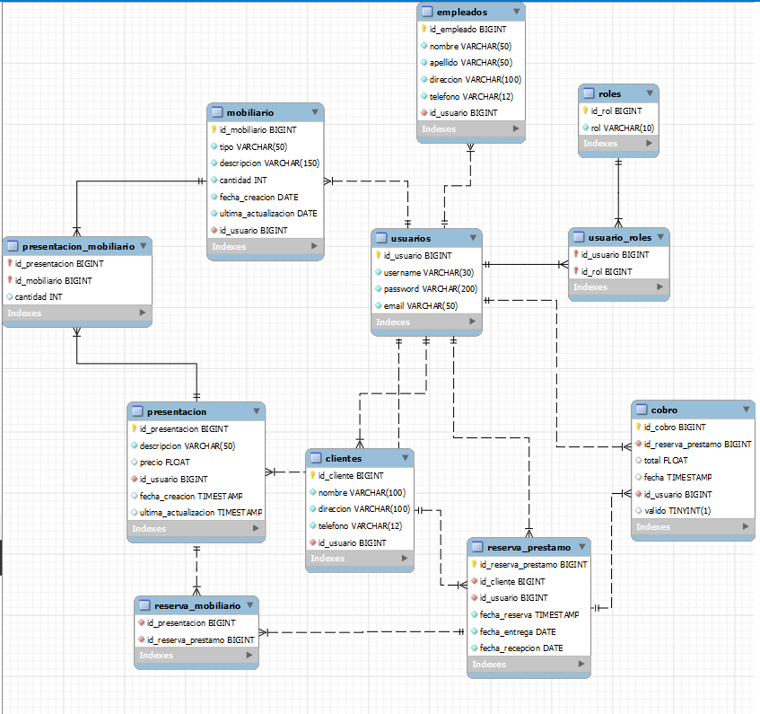

<h1 align="center"> Control de mobiliario</h1>

## Descripcion

- Aplicacion creada para personal encargado del prestamo de mobiliario.
- Proyecto dividido en dos partes, Backend y Frontend. En esta parte veremos los detalles relevantes para el Backend.

### Tecnologias utilizadas

---

---

- Spring Boot 3 Version 3.2.2
- Java Version 17
- Seguridad JJWT Version 0.12.3 (JSON Web Tokens)
- Starter Mail para el envio de correos
- Mysql 8.0.34
- JPQL (Java Persistence Query Language)

## Estructura del proyecto

- component: Contiene codigo para iniciar el proyecto por primera vez
- controller: Contiene los controladores para todos los endpoints
- dto: Contiene los archivos con los que se maneja la informacion que viaja desde y hacia el usuario que consume los endpoints y la validacion de datos.
- infra:
  - config: Contiene la configuracion para el envio de emails
  - errors: Contiene archivos encargados de controlar los errores en el programa
  - security: Contiene los archivos responsables de la seguridad en el proyecto.
- models: Contiene los archivos que representan las tablas de la base de datos utilizada
- service: Contiene los archivos en los que se encuentra la logica para el manaejo de operaciones con la BD

## Diagrama de la base de datos

- Dentro de la carpeta /ReadmeAssets se encuentra el diagrama creado con Workbench

### Usuario inicial

- Username: admin
- Password: admin

## Funciones del proyecto

- Control de acceso mediante autenticacion y autorizacion a traves de tokens jwt
- Registro, edicion, lectura y eliminacion de:
  - Usuarios
  - Empleados
  - Clientes
  - Reservaciones
  - Cobros
  - Presentaciones de mobiliario
  - Tipos de mobiliario
- Valida la disponibilidad de mobiliario para una fecha determinada en funcion de los prestamos agendados
- Permite la recuperacion de contraseñas enviando un enlace al email registrado, con una cadena que dá la autorizacion de actualizar la contraseña del usuario

## Endpoints

- /clients

  - [POST]http://host:8080/clients -> Recibe los datos para la creacion de un nuevo cliente

  - [POST]http://host:8080/clients/name -> Realiza una consulta a traves del nombre, devuelve los datos correspondientes al usuario si existe.

  - [GET]http://host:8080/clients -> Realiza un consulta de todos los clientes registrados en el banco de datos

  - [GET]http://host:8080/clients/{id} -> Permite leer la informacion de un registro de la entidad ClientsEntity (tabla clientes) utilizando la clave id como parametro de filtro

  - [PUT]http://host:8080/clients -> Permite actualizar los datos del cliente con la informacion recibida

  - [DELETE]http://host:8080/clients/{id} -> Permite eliminar un registro utilizando su id

  - [DELETE]http://host:8080/clients/{id} -> Elimina el cliente junto con las reservaciones que haya realizado siempre y cuando las reservaciones no hayan sido entregadas o no se encuentren vigentes (es decir, presetadas)

- /cobros

  - [POST]http://host:8080/cobros -> Crea un registro con el cobro realizado para la reservacion
  - [POST]http://host:8080/cobros/fecha -> Consulta los cobros de una fecha determinada
  - [GET]http://host:8080/cobros -> Consulta todos los cobros almacenadaos
  - [GET]http://host:8080/cobros/{idReservacion} -> Consulta la informacion completa de una reservacion y el total de la misma
  - [GET]http://host:8080/cobros/valid -> Consulta los cobros validos almacenados en la tabla cobros
  - [GET]http://host:8080/cobros/canceled -> Consulta los registros de cobros cancelados
  - [GET]http://host:8080/cobros/total -> Calcula el total de los cobros realizados en un dia determinado
  - [GET]http://host:8080/cobros/periodo -> Generar el total de cobros hechos dentro de un periodo de tiempo determinado
  - [PUT]http://host:8080/cobros -> Permite actualizar el total de cobro de un registro, unicamente para usuarios de tipo ADMIN
  - [DELETE]http://host:8080/cobros/cancel/{idCobro} -> Cancela un registro de la entidad CobroEntity (tabla cobro)
  - [DELETE]http://host:8080/cobros/{id} -> Elimina un registro de la tabla cobro utilizando el parametro recibido por url

- /employees

  - [POST]http://host:8080/employees -> Recibe los datos necesarios para crear un registro
  - [GET]http://host:8080/employees -> Consulta todos los registros almacenados
  - [GET]http://host:8080/employees/{id} -> Consulta la informacion de un empleado en especifico usando su id
  - [GET]http://host:8080/employees/myData/{username} -> Regresa la informacion de empmleado del usuario que realiza la peticion
  - [PUT]http://host:8080/employees -> Actualiza los datos del registrso con la informacion recibida
  - [DELETE]http://host:8080/employees/{id} -> Elimina el registro que coincida con el id recibido

- /v1

  - [POST]http://host:8080/v1/sendMessage -> Envia un email utilizando los parametros recibidos
  - [POST]http://host:8080/v1/sendFile -> Envia un email utilizando los parametros recibidos incluyendo archivos

- /mobiliario

  - [POST]http://host:8080/mobiliario -> Crea un registro de mobiliario con la informacion recibida
  - [GET]http://host:8080/mobiliario -> Consulta todos los registros almacenados
  - [GET]http://host:8080/mobiliario/{id} -> Consulta los datos de un registro especifico utilizando el id recibido
  - [PUT]http://host:8080/mobiliario -> Actualiza los registros de mobiliario con la informacion recibida
  - [DELETE]http://host:8080/mobiliario -> Elimina el registro que coincide con el id enviado por parametro

- /presentation

  - [POST]http://host:8080/presentation -> Crea una nueva presentacion
  - [GET]http://host:8080/presentation -> Consulta todos los registros almacenados
  - [GET]http://host:8080/presentation/{id} -> Recupera un registro de la tabla presentacion y los registros enlazados a la tabla presentacion_mobiliario utilizando el id recibido a traves de la url como parametro de busqueda
  - [PUT]http://host:8080/presentation/all -> Actualiza la informacion del registro indicado.
  - [DELETE]http://host:8080/presentation/{id} -> Elimina el registro que coincide con el id recibido

- /recover

  - [GET]http://host:8080/recover/{data} -> Verifica que el usuario/email recibido sean validos y manda manda un enlace al email registrado en la base de datos con un hash de autorizacion que debera usarse para actualizar el password

  - [POST]http://host:8080/recover/recovery -> Valida el hash recibido para proceder con la actualizacion de la contraseña

- /reservacion

  - [POST]http://host:8080/reservacion -> Creaa una nueva reservacion con los datos recibidos en la peticion
  - [POST]http://host:8080/reservacion/periodo -> Consulta los registros que se encuentren dentro de un periodo especifico de tiempo
  - [GET]http://host:8080/reservacion -> Consulta todos los registros de la tabla reservaciones
  - [GET]http://host:8080/reservacion/{id} -> Busca en la tabla el registro que coincida con el id recibido
  - [GET]http://host:8080/reservacion/statusOne -> Consulta los registros de la tabla reservacion con estatus 1 - entregdo
  - [GET]http://host:8080/reservacion/vigente -> Consulta los registros de las reservaciones que aun no se han entregado y tampoco han sido canceladas
  - [GET]http://host:8080/reservacion/entregas -> Consulta las reservaciones con fecha de entrega del dia en curso
  - [GET]http://host:8080/reservacion/recepcion -> Consulta las reservaciones con fecha de recepcion del dia en curso
  - [PUT]http://host:8080/reservacion -> Actualiza un registro de la tabla
  - [DELETE]http://host:8080/reservacion -> Elimina un registro de la tabla con la informacion recibida en la peticion
  - [DELETE]http://host:8080/reservacion/{id} -> Elimina el registro de la tabla que coincida con el parametro recibido

- /tipoMobiliario
  - [POST]http://host:8080/tipoMobiliario -> Crea un registro para el tipo de mobiliario
  - [GET]http://host:8080/tipoMobiliario -> Consulta todos los registros almacenados
  - [GET]http://host:8080/tipoMobiliario/{id} -> Consulta un registro especifico utilizando el parametro recibido a traves de la url
  - [PUT]http://host:8080/tipoMobiliario -> Actualiza un registro con la informacion recibida en la peticion
  - [DELETE]http://host:8080/tipoMobiliario/{id} -> Elimina un registro utilizando el parametro recibido a traves de la url
- /users

  - [POST]http://host:8080/users/createUser -> Crea un usuario nuevo
  - [POST]http://host:8080/users/createUserEmployee -> Crea un usuario con datos de empleado
  - [GET]http://host:8080/users/avialable/{username} -> Consulta la disponibilidad de un usuario
  - [GET]http://host:8080/users/avialableue/{username}/{nombre}/{apellido} -> Consulta la disponibilidad de datos de empleado
  - [GET]http://host:8080/users -> Consulta todos los registros de los usuarios
  - [GET]http://host:8080/users/{id} -> Consulta los datos de un registro utilizando el id recibido en la url
  - [GET]http://host:8080/users/actual -> Consulta los datos del usuario que realiza la peticion

  - [DELETE]http://host:8080/users/{id} -> Elimina un registro de usuario utilizando el parametro recibido por la url
  - [DELETE]http://host:8080/users/delteUserEmployee/{id} -> Elimina el registro de un usuario y un empleado utilizando el parametro recibido por la url

  - [PUT]http://host:8080/users -> Actualiza los datos de un registro con la informacion recibida en la peticion

  - [PUT]http://host:8080/users/update -> Actualiza los datos de un usuario

  - [PUT]http://host:8080/users/updateComplete -> Actualiza los datos completos de un usuario, es decir, los datos de usuario y los del empleado

---

<h2 align="center">
Buscame en mis redes 

</h2> 

